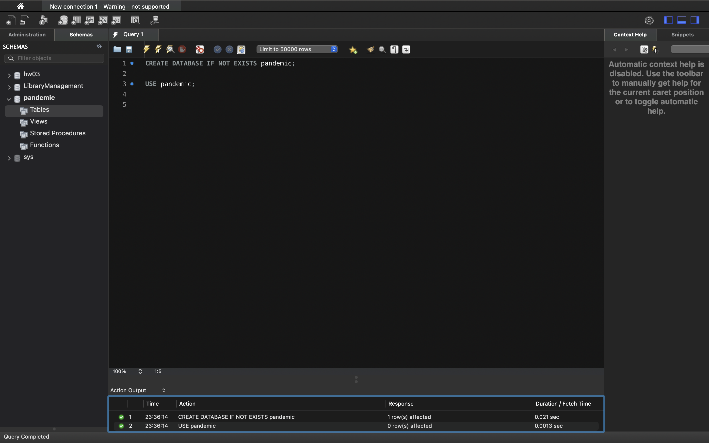
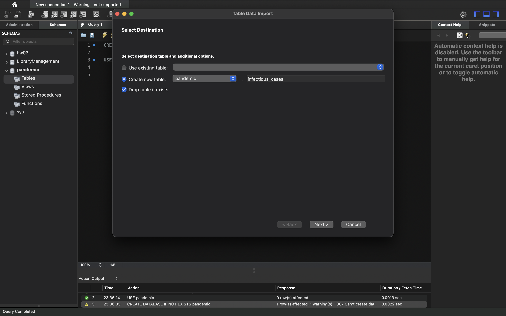
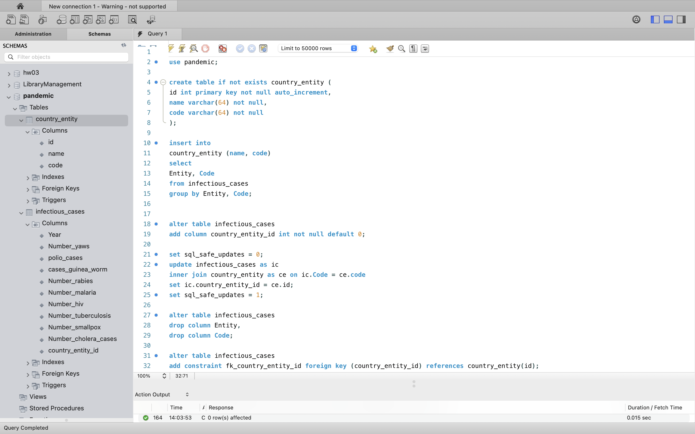
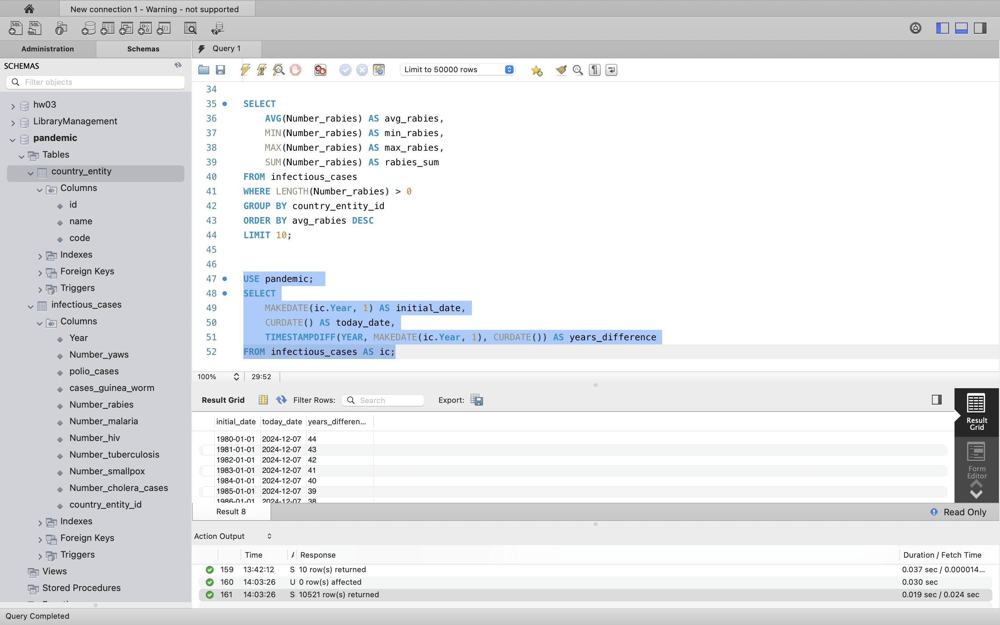
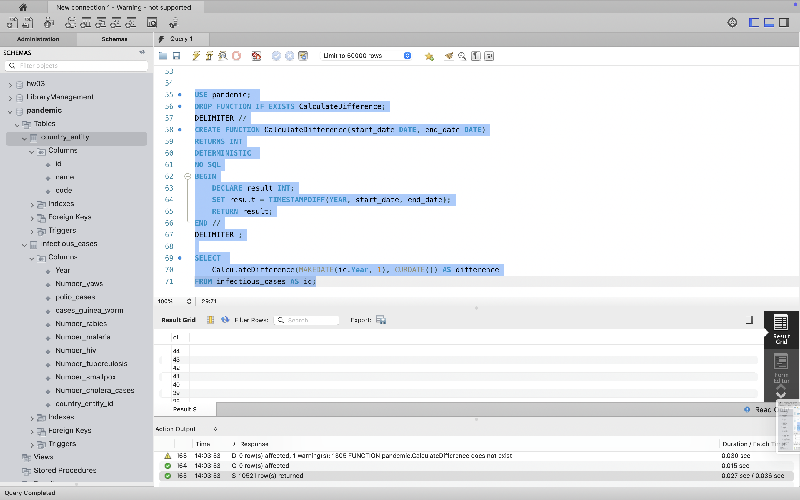

# SQL Relation DB Final Project

## 1. Завантажте дані:
* Створіть схему pandemic у базі даних за допомогою SQL-команди.
* Оберіть її як схему за замовчуванням за допомогою SQL-команди.
* Імпортуйте дані за допомогою Import wizard так, як ви вже робили це у темі 3.
* Продивіться дані, щоб бути у контексті. 




```sql
CREATE DATABASE IF NOT EXISTS pandemic;
USE pandemic;
```


## 2. Нормалізуйте таблицю infectious_cases до 3ї нормальної форми. Збережіть у цій же схемі дві таблиці з нормалізованими даними.



```sql

use pandemic;

create table if not exists country_entity (
id int primary key not null auto_increment,
name varchar(64) not null,
code varchar(64) not null
);

insert into
country_entity (name, code)
select
Entity, Code
from infectious_cases
group by Entity, Code;


alter table infectious_cases
add column country_entity_id int not null default 0;

set sql_safe_updates = 0;
update infectious_cases as ic
inner join country_entity as ce on ic.Code = ce.code
set ic.country_entity_id = ce.id;
set sql_safe_updates = 1;

alter table infectious_cases
drop column Entity,
drop column Code;

alter table infectious_cases
add constraint fk_country_entity_id foreign key (country_entity_id) references country_entity(id);
```


## 3. Проаналізуйте дані: Для кожної унікальної комбінації Entity та Code або їх id порахуйте середнє, мінімальне, максимальне значення та суму для атрибута Number_rabies. Врахуйте, що атрибут Number_rabies може містити порожні значення ‘’ — вам попередньо необхідно їх відфільтрувати. Результат відсортуйте за порахованим середнім значенням у порядку спадання. Оберіть тільки 10 рядків для виведення на екран.


```sql
SELECT 
	AVG(Number_rabies) AS avg_rabies, 
    MIN(Number_rabies) AS min_rabies, 
    MAX(Number_rabies) AS max_rabies, 
    SUM(Number_rabies) AS rabies_sum
FROM infectious_cases
WHERE LENGTH(Number_rabies) > 0
GROUP BY country_entity_id 
ORDER BY avg_rabies DESC
LIMIT 10;
```

## 4. Побудуйте колонку різниці в роках. Для оригінальної або нормованої таблиці для колонки Year побудуйте з використанням вбудованих SQL-функцій: атрибут, що створює дату першого січня відповідного року,атрибут, що дорівнює поточній даті, атрибут, що дорівнює різниці в роках двох вищезгаданих колонок.



```sql
USE pandemic; 
SELECT
	MAKEDATE(ic.Year, 1) AS initial_date,
	CURDATE() AS today_date,
    TIMESTAMPDIFF(YEAR, MAKEDATE(ic.Year, 1), CURDATE()) AS years_difference
FROM infectious_cases AS ic;
```

## 5. Побудуйте колонку різниці в роках. Для оригінальної або нормованої таблиці для колонки Year побудуйте з використанням вбудованих SQL-функцій: атрибут, що створює дату першого січня відповідного року,атрибут, що дорівнює поточній даті, атрибут, що дорівнює різниці в роках двох вищезгаданих колонок.



```sql
USE pandemic; 
DROP FUNCTION IF EXISTS CalculateDifference;
DELIMITER //
CREATE FUNCTION CalculateDifference(start_date DATE, end_date DATE)
RETURNS INT
DETERMINISTIC 
NO SQL
BEGIN
    DECLARE result INT;
    SET result = TIMESTAMPDIFF(YEAR, start_date, end_date);
    RETURN result;
END //
DELIMITER ;

SELECT 
	CalculateDifference(MAKEDATE(ic.Year, 1), CURDATE()) AS difference
FROM infectious_cases AS ic;
```